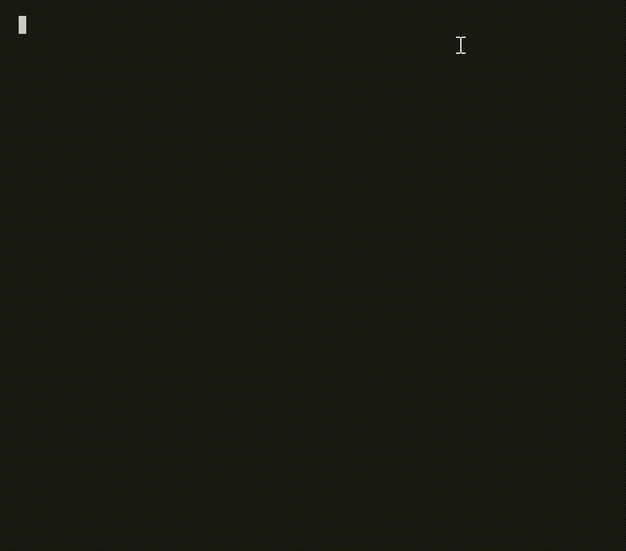

# Tower-of-Hanoi

A terminal-based Towers of Hanoi solver demonstrating **recursion** and **iteration** with ASCII graphics.

## How it works

The core solver is a single recursive function:

```python
def hanoi(n, src, dst, depth=0):
    if n == 1:                            # base case
        _move(src, dst, depth)
        return
    other = 3 - src - dst
    hanoi(n - 1, src, other, depth + 1)  # recursive: move top n-1 aside
    _move(src, dst, depth)               # move largest disc
    hanoi(n - 1, other, dst, depth + 1) # recursive: place n-1 on top
```

The renderer uses nested `for` loops (iteration) to draw the rod state after every move.

## Usage

```bash
python3 towers_of_hanoi.py        # default: 5 discs
python3 towers_of_hanoi.py 3      # specify disc count (1–8)
```

## Configuration

| Variable | Default | Description |
|---|---|---|
| `NUM_DISCS` | `5` | Number of discs |
| `DELAY` | `0.85` | Seconds between moves |

## Concepts illustrated

- **Recursion** — base case + recursive leap of faith (`hanoi`)
- **Iteration** — render loop, move log (`render`, `print_summary`)
- **Optimal moves** — always solves in exactly `2ⁿ − 1` moves

# Demo


